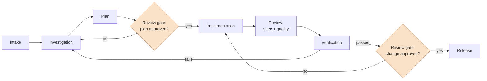

# Agentic Engineering Standards

Repeatable workflows and standards for AI-assisted software development — built to make the whole engineering process more efficient, and reliable enough to trust.

## The problem

AI makes it easy to produce more code. But more code is not more shipped software.

Most engineering effort isn't lost writing code. It's lost around it: rework from unclear scope, inconsistent quality between changes, work stalled in review, features that looked finished but never safely reached production. Adding AI output to a leaky process just moves the bottleneck downstream.

Standards are what make the added speed hold.

## The idea

Treat AI-assisted development as an engineering process, not a typing accelerator:

- The workflow is defined before the work starts. The same input gets the same process.
- Every change passes a **review gate** — a defined point where human judgment is required, not optional.
- **Verification is a step, not an assumption.** The workflow isn't done when the code exists; it's done when the fix is demonstrated.
- The agent proposes; the engineer decides.

## The lifecycle



The highlighted nodes are where human judgment is required. Everything else can be agent-driven — but nothing crosses a gate without an engineer's decision.

## Workflows

| Workflow | Status | Covers |
|---|---|---|
| [Bug resolution](workflows/bug-resolution.md) | 🚧 Being documented | intake → reproduction → fix → verification |
| [Feature development](workflows/feature-development.md) | 🚧 In progress | spec → implementation → review → release |

## Structure

```
docs/             # architecture decisions — what was chosen, what was rejected, why
workflows/        # end-to-end SDLC workflows (the process definitions)
patterns/         # reusable mechanics: scouts, gates, verification, the harness
.claude/
├── skills/       # primary asset class: workflow stages + auto-activating standards
├── commands/     # prompt-only entrypoints (/prime)
├── agents/       # implementations that consume skills (scout, reviewer, verifier)
└── hooks/        # deterministic harness: format, lint, typecheck on every edit
.claude-context/
├── bugs/         # per-bug artifact trails (issue → investigation → plan → review → verification)
├── specs/        # feature specs and plans
├── templates/    # bug report, PR — the shapes artifacts start from
└── local/        # personal scratch, gitignored
examples/         # worked examples — real work taken through the workflows
```

Skills are the primary asset class — user-invocable by name and auto-activating by trigger; agents consume skill capabilities via frontmatter. `commands/` is kept for prompt-only entrypoints. See [docs/architecture-decisions.md](docs/architecture-decisions.md).

## Deployment (multi-repo)

This repo is the canonical source. Three supported modes, in priority order:

1. **User-level (`~/.claude/`)** — the daily driver. Skills follow you into every repo and editor window; zero per-repo deploys. Setup: symlink the skills per [docs/development.md](docs/development.md).
2. **Per-repo** *(planned)* — `/deploy-config <target> [--minimal]` will copy a selected slice into a repo that must be self-contained (public projects, CI, teams).
3. **Workspace root** — `.claude/` at a workspace root with repos underneath, agent launched at the root.

One source of truth; deploys are one-way pushes from here. Selective loading happens via flags, never by fragmenting the layer.

## What this is not

- **Not a replacement for engineering judgment.** The gates exist because judgment is the point.
- **Not automation for its own sake.** If a step is faster and safer by hand, do it by hand.
- **Not a prompt library.** Prompts change; the process is the asset.

## Status

Public, under active construction. Bug resolution is in daily use on my own projects and being documented; feature development is being extracted from practice. The worked example will be captured live from a real fix.

## License

MIT — see [LICENSE](LICENSE).

## Provenance & credits

This is my own agentic layer, built from scratch, following the agentic engineering principles taught in **[IndyDevDan](https://www.youtube.com/@indydevdan)**'s course. The stage partition, the two review gates, the architecture decisions, and every skill here are mine; where they diverge from the course's reference patterns, [the ADRs](docs/architecture-decisions.md) record why.

---

*Built and maintained by [Simon Cheam](https://www.simoncheam.dev) — full stack engineer working on agentic AI.*
