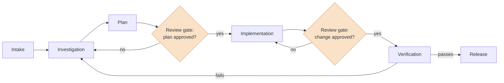

# Agentic Engineering Standards

Repeatable workflows and standards for AI-assisted software development — built to make the whole engineering process more efficient, and reliable enough to trust.

## The problem

AI makes it easy to produce more code. But more code is not more shipped software.

Most engineering effort isn't lost writing code. It's lost around it: rework from unclear scope, inconsistent quality between changes, work stalled in review, features that looked finished but never safely reached production. Adding AI output to a leaky process just moves the bottleneck downstream.

Standards are what make the added speed hold.

## The idea

Treat AI-assisted development as an engineering process, not a typing accelerator:

- The workflow is defined before the work starts. The same input gets the same process.
- Every change passes a **review gate** — a defined point where human judgment is required, not optional.
- **Verification is a step, not an assumption.** The workflow isn't done when the code exists; it's done when the fix is demonstrated.
- The agent proposes; the engineer decides.

## The lifecycle



The highlighted nodes are where human judgment is required. Everything else can be agent-driven — but nothing crosses a gate without an engineer's decision.

## Workflows

| Workflow | Status | Covers |
|---|---|---|
| [Bug resolution](workflows/bug-resolution.md) | 🚧 Being documented | intake → reproduction → fix → verification |
| [Feature development](workflows/feature-development.md) | 🚧 In progress | spec → implementation → review → release |

## Structure

```
workflows/       # end-to-end SDLC workflows (the process definitions)
patterns/        # reusable mechanics: review gates, verification, failure modes
.claude/         # runnable layer: commands, skills, hooks for Claude Code
examples/        # worked examples — real work taken through the workflows
```

## Using this in your own project

1. Copy [`.claude/`](.claude/) into your repo — the conventions template and workflow commands.
2. Adapt `CLAUDE.md` to your project's stack and standards.
3. Run the workflow on your next bug. Keep the artifacts.

## What this is not

- **Not a replacement for engineering judgment.** The gates exist because judgment is the point.
- **Not automation for its own sake.** If a step is faster and safer by hand, do it by hand.
- **Not a prompt library.** Prompts change; the process is the asset.

## Status

Private, under active construction. Bug resolution is in daily use and being documented; feature development is being extracted from practice. The worked example will be captured live from a real fix before this repo goes public.

---

*Built and maintained by [Simon Cheam](https://www.simoncheam.dev) — full stack engineer working on agentic AI.*
